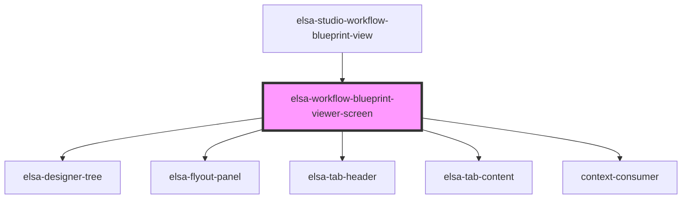

# elsa-workflow-instance-viewer-screen

<!-- Auto Generated Below -->

## Properties

| Property                  | Attribute              | Description | Type     | Default     |
| ------------------------- | ---------------------- | ----------- | -------- | ----------- |
| `activityDescriptorsJson` | `activity-descriptors` |             | `string` | `undefined` |
| `culture`                 | `culture`              |             | `string` | `undefined` |
| `workflowBlueprintJson`   | `workflow-blueprint`   |             | `string` | `undefined` |

## Dependencies

### Used by

 - [elsa-studio-workflow-blueprint-view](../../../dashboard/pages/elsa-studio-workflow-blueprint-view)

### Depends on

- [elsa-designer-tree](../../../designers/tree/elsa-designer-tree)
- [elsa-flyout-panel](../../../shared/elsa-flyout-panel)
- [elsa-tab-header](../../../shared/elsa-tab-header)
- [elsa-tab-content](../../../shared/elsa-tab-content)
- context-consumer

### Graph

----------------------------------------------

*Built with [StencilJS](https://stenciljs.com/)*
